Je conçois des applications web et mobiles qui répondent à des besoins concrets en RD Congo : le suivi scolaire, le commerce en ligne, la restitution d'objets perdus.

- Je construis des produits complets, de l'interface jusqu'au serveur et aux règles de sécurité.
- Je travaille surtout en **TypeScript**, avec **React** côté interface et **Firebase** ou **Express** côté données.
- Je soigne ce qui compte sur le terrain : le fonctionnement hors ligne, le paiement Mobile Money, l'usage sur téléphone.

<table>
  <tr>
    <td width="50%" valign="top">
      <h3>Gomarché</h3>
      
<code>EXPÉDITION 01</code> · <code>EN LIGNE</code>

      
Supermarché en ligne à Goma. Six espaces selon le rôle : client, préparateur, caissier, livreur, agent de rayon, administrateur. Suivi du livreur par GPS et paiement Mobile Money.

      
React · Express · Firebase · Leaflet

      
<a href="https://gomarche.vercel.app">Voir le site</a> · <a href="https://github.com/Phan-1006/gomarche">Code</a>

    </td>
    <td width="50%" valign="top">
      <h3>ParentEcole</h3>
      
<code>EXPÉDITION 02</code> · <code>EN COURS</code>

      
Suivi scolaire entre l'école et les parents : présences, frais, reçus, devoirs, conduite, communiqués. Une app Android pour les parents, un site pour l'école, lisible sans réseau.

      
React · Capacitor · Firestore · Vitest

      
<a href="https://github.com/Phan-1006/ecoleparent">Code</a>

    </td>
  </tr>
  <tr>
    <td width="50%" valign="top">
      <h3>Congo Objet Trouvé</h3>
      
<code>EXPÉDITION 03</code> · <code>EN LIGNE</code>

      
Restitution d'objets perdus grâce à des autocollants QR. Celui qui trouve l'objet scanne le code et contacte le propriétaire, sans voir ses données personnelles.

      
React · Express · Firebase · Socket.IO

      
<a href="https://objetsperdus.online/">Voir le site</a>

    </td>
    <td width="50%" valign="top">
      <h3>Zone inexplorée</h3>
      
<code>EXPÉDITION 04</code> · <code>À VENIR</code>

      
Le prochain projet apparaîtra ici.

    </td>
  </tr>
</table>

  
  
  
  
  
  
  
  
  
  
  
  

Une idée, un projet, une question ? Ouvrez une [issue](https://github.com/Phan-1006/Phan-1006/issues) ou écrivez-moi depuis mon profil.

